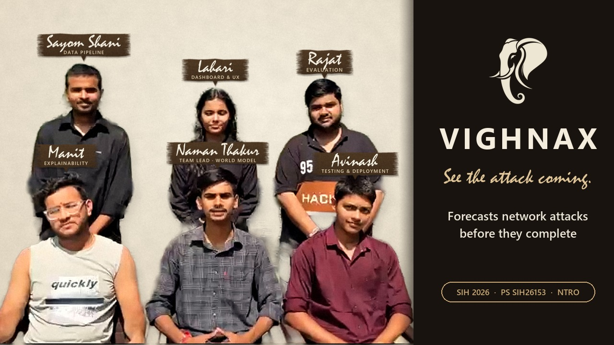
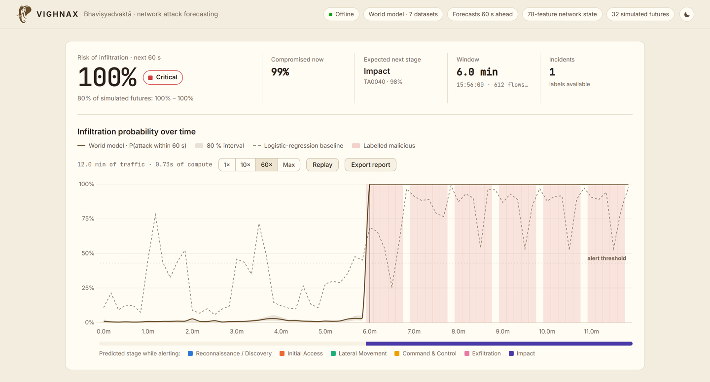
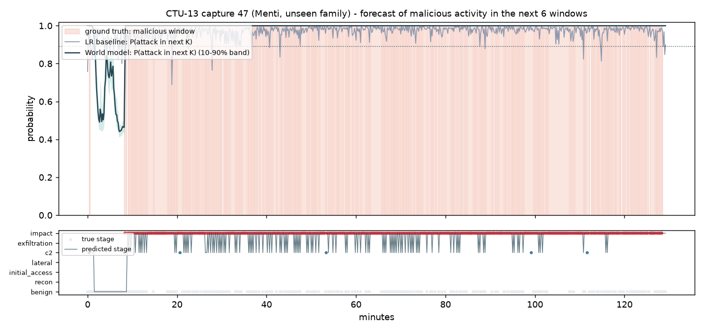
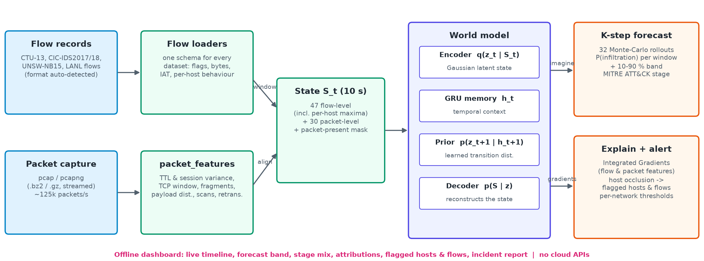

<p align="center">
  <picture>
    <source media="(prefers-color-scheme: dark)" srcset="docs/images/logo_ivory.png">
    
  </picture>
</p>

<h1 align="center">VIGHNAX — BhaviṣyAdvaktā</h1>

<p align="center"><b>A world model that forecasts network attacks before they complete.</b><br>
AI-based network attack forecasting from network traffic data · runs fully offline</p>

<p align="center">
  <a href="https://github.com/NAMAN-THAKUR-1944/SIH2026-SIH26153-VIGHNAX/actions/workflows/tests.yml"></a>
  
  
  
</p>

## Smart India Hackathon 2026

| | |
|---|---|
| **Problem Statement ID** | SIH26153 |
| **Problem Statement Title** | AI based Network Attack Forecasting from Network Traffic Data |
| **Organisation** | National Technical Research Organisation (NTRO) |
| **Theme** | Blockchain & Cybersecurity |
| **PS Category** | Software |
| **Team ID** | 127364 |
| **Team Name** | VIGHNAX |

**Deliverables requested in the problem statement**

| Deliverable | Where |
|---|---|
| Source code | this repository |
| Readme with setup instructions | [Setup](#setup) |
| Architecture document (max 2 pages) | [`docs/VIGHNAX_Architecture.pdf`](docs/VIGHNAX_Architecture.pdf) |
| Demo video (max 2 minutes) | [YouTube, 1:59](https://youtu.be/pPTe-d_TByU) · [Demo video](#demo-video) |
| Technical presentation (max 5 slides) | [`docs/VIGHNAX_Technical_Presentation.pdf`](docs/VIGHNAX_Technical_Presentation.pdf) |
| Idea presentation in the official SIH 2026 template | [`docs/VIGHNAX_SIH_Idea_Presentation.pdf`](docs/VIGHNAX_SIH_Idea_Presentation.pdf) |

## Demo video

[](https://youtu.be/pPTe-d_TByU)

**YouTube (1:59):** [https://youtu.be/pPTe-d_TByU](https://youtu.be/pPTe-d_TByU)

<picture>
  <source media="(prefers-color-scheme: dark)" srcset="docs/images/dashboard_dark.png">
  
</picture>

<sub>A real CIC-IDS2017 day the model never saw in training: the risk stays low for six minutes and turns critical as the
DDoS starts, while the logistic-regression baseline (dashed) keeps raising false spikes.</sub>

## Overview

Traditional IDS models classify each flow in isolation. VIGHNAX instead learns *how the state of a network evolves*,
P(S<sub>t+1</sub> | S<sub>≤t</sub>), from flow-level **and** packet-level telemetry. It then rolls that model forward
K steps to estimate whether the current trajectory leads to compromise, *before* the attacker acts, and says which
MITRE ATT&CK stage is coming, which traffic features drive the prediction and which hosts are responsible.

<!-- RESULTS-START -->
### Results: one model, seven datasets, test data unseen in training

AUROC, world model / logistic-regression baseline on the same features (bold = world model better). Every test source is a day, capture, time slice or botnet family that was not used for training.

| Dataset | Test windows | Forecast (next 60 s) | Early warning (still benign) | Detection (now) | Warned before onset |
|---|---|---|---|---|---|
| CTU-13 | 2,287 | **0.83** / 0.60 | **0.82** / 0.48 | **0.89** / 0.74 | 8/9 vs 3/9 |
| CIC-IDS2017 | 2,904 | 0.56 / 0.56 | 0.47 / 0.47 | 0.65 / 0.65 | 6/102 vs 4/102 |
| CSE-CIC-IDS2018 | 6,554 | **0.83** / 0.60 | **0.57** / 0.55 | **0.83** / 0.62 | 1/4 vs 0/4 |
| UNSW-NB15 | 3,101 | 0.95 / 0.99 | 0.63 / 0.71 | **1.00** / 0.95 | 5/5 vs 0/5 |
| LANL cyber1 | 4,320 | 0.37 / 0.56 | 0.34 / 0.57 | 0.40 / 0.55 | 0/10 vs 1/10 |
| DARPA 1999 | 31,679 | 0.63 / 0.69 | 0.60 / 0.61 | 0.69 / 0.81 | 34/71 vs 9/71 |
| CICIoT2023 | 395 | n/a | n/a | **0.99** / 0.76 | n/a |
| **Macro average** (6 temporal datasets) | | **0.70** / 0.67 | 0.57 / 0.57 | **0.74** / 0.72 | 54/201 vs 17/201 |

* **Forecasting (next 60 s):** world model ahead on 2 of 6 datasets, tied on CIC-IDS2017, LR ahead on UNSW-NB15, LANL cyber1, DARPA 1999. Early warning from still-benign windows: ahead on 2, tied on CIC-IDS2017, LR ahead on UNSW-NB15, LANL cyber1, DARPA 1999.
* **Detection of the current window:** world model ahead on 4 of 7 datasets, tied on CIC-IDS2017, LR ahead on LANL cyber1, DARPA 1999.
* **Early warning before attack onsets:** 54 of 201 onsets across the temporal datasets were forecast before they started by the world model, 17 by LR.
* **MITRE ATT&CK stage identification** on malicious test windows (all datasets): accuracy 0.49, macro-F1 0.33.
* Alert thresholds are calibrated per network on that dataset's own validation split (the dashboard uses the matching profile, or a global one for unknown networks). F1 / FPR per dataset are in `results/RESULTS.md`.
* CICIoT2023 captures hold one activity each; its episodes are composed (benign capture, then attack capture), so only detection is scored there.



Full tables (pooled metrics, F1 / FPR, validation per dataset, packet-block ablation, runtime): [`results/RESULTS.md`](results/RESULTS.md). Batched inference costs 0.04 ms per 10 s window on the GPU (32 Monte-Carlo rollouts; about 8 ms per window when windows are streamed one at a time on a laptop CPU).
<!-- RESULTS-END -->

---

## What makes it different

* **It forecasts instead of only detecting.** A learned world model of the network's state simulates 32 possible
  futures 60 s ahead, so an alert can come before the attack completes. On unseen test traffic it forecast 54 of 201
  attack onsets before they began, against 17 for a logistic-regression baseline on the same features.
* **It says why, and who.** Every forecast is explained with Integrated Gradients, and removing each host in turn and
  re-running the forecast ranks the hosts behind an alert. Both panels update live while the traffic plays.
* **One model for all seven PS datasets,** tested only on days, captures, time slices and botnet families it never
  saw, with its weak spots reported rather than hidden (see [Limitations](#limitations-stated-plainly)).
* **Air-gap ready.** No internet, CDN or cloud API: fonts and scripts are bundled, inference runs on one laptop CPU
  core (about 8 ms per 10 s window), and the dashboard verifies the model weights against `models/SHA256SUMS` at start-up.
* **SOC-ready output.** One click exports a self-contained incident report (first warning, peak risk, ATT&CK stage,
  driving features, flagged hosts and flows, and a check against the dataset's labels when they exist) that prints to PDF.
* **Built for analysts.** Live timeline with playback from real time to maximum speed, light and dark themes,
  colour-blind-safe stage colours, a legend and tooltips on every chart.
* **Reproducible and tested.** One seeded configuration regenerates every number in this README, the architecture
  document and both presentations; a CI workflow verifies the weights and runs the test suite on every push.

## Setup

**Requirements:** Python 3.10 or newer on Windows, Linux or macOS, and about 1.5 GB of disk for the dependencies.
Running the dashboard needs no GPU and no internet connection.

**One click:** after cloning, double-click **`run.bat`** (Windows) or run **`./run.sh`** (Linux / macOS). The first run
creates a private Python environment in `.venv` and installs the requirements (a few minutes, internet needed once);
every run then starts the dashboard with that environment and opens it in your browser.

**Manual setup:**

```bash
git clone https://github.com/NAMAN-THAKUR-1944/SIH2026-SIH26153-VIGHNAX.git
cd SIH2026-SIH26153-VIGHNAX
python -m venv .venv
# activate it:  Windows  .venv\Scripts\activate      Linux / macOS  source .venv/bin/activate
pip install torch --index-url https://download.pytorch.org/whl/cpu    # optional: the smaller CPU-only PyTorch
pip install -r requirements.txt
python server.py                                                       # then open http://127.0.0.1:5000
```

Check the installation (both run offline):

```bash
python -m src.integrity      # the model weights match models/SHA256SUMS
python -m pytest -q          # test suite
```

### Using the dashboard

1. **Pick a bundled capture** (one per PS dataset, each cut from that dataset's unseen test data) or **drop your own
   traffic** into the single upload box: flow records in any PS dataset's native format (CTU-13 binetflow,
   CIC-IDS2017/2018 CSV, UNSW-NB15 CSV, LANL flows), a packet capture (pcap / pcapng, also .gz or .bz2), both, or a .zip.
   The format is detected from the file content.
2. **Watch the forecast grow.** The world model processes the capture window by window in time order. Playback runs at
   1× (real time, as a live sensor would deliver it), 10×, 60× or maximum speed; the model itself needs about 8 ms per
   10-second window on a laptop CPU.
3. **Read the panels.** The forward simulation, the ATT&CK stage mix, the feature attributions and the flagged hosts
   and flows follow the newest window while the capture plays (explanations take about 0.13 s each, so at 60× they can
   trail the timeline by a window or two). Click any point on the timeline to hold the panels on that moment;
   **Follow live** resumes.
4. **Export report** saves a self-contained incident report of the analysis (HTML; print it to PDF from the browser).
5. The button at the top right switches between the dark and the light theme.

`http://127.0.0.1:5000/?sample=cicids2017_sample` starts a bundled capture directly (ids are in `samples/samples.json`).

### Troubleshooting

| Message | What to do |
|---|---|
| *Cannot reach the VIGHNAX server* | The server is not running (its window was closed). Start it again with `run.bat`, `./run.sh` or `python server.py` and reload the page. |
| *VIGHNAX is already running at …* | A server from an earlier start is still open. Use the address it prints, or close that window first; two servers never share one port. |
| *This analysis is no longer on the server* | The server was restarted, or newer analyses replaced it (it keeps the last four). Click the capture again. |
| An error mentioning `multi_class` or scikit-learn | Your copy is older than the JSON baseline; pull the latest version. The shipped models no longer depend on the scikit-learn version. |
| Anything else | Run it from `run.bat` / `./run.sh` (or activate `.venv` first) so the right Python and packages are used, then `python -m src.integrity` and `python -m pytest -q`. |

## Problem statement compliance

| PS requirement | Where it is implemented |
|---|---|
| Ingest flow records (NetFlow/IPFIX-style) **and** PCAPs | `src/data/datasets.py` universal loader: CTU-13 binetflow, CIC-IDS2017/2018 CSV, UNSW-NB15, LANL flows (format detected from content) · `src/data/packet_features.py` (pcap / pcapng / .bz2 / .gz, ~125k packets/s) · `src/data/pcap_parser.py` (Scapy reference parser) |
| Flow-level features: IP/port pairs, TCP flags, protocol, bytes, packets, duration, IAT mean/var/max, bidirectional ratios | `FLOW_FEATURES` in `src/data/state_builder.py` |
| Packet-level features: TTL + per-session TTL variance, TCP window, IP fragment flags, payload-size distribution, port-scan signatures (sequential vs randomised), retransmissions | `PACKET_FEATURES` in `src/data/packet_features.py` |
| Network state S<sub>t</sub> as a structured feature vector | `src/data/state_builder.py` — 78-dim state per 10 s window (47 flow-level incl. per-host maxima + 30 packet-level + mask) |
| Learn P(S<sub>t+1</sub> \| S<sub>t</sub>) with a sequence / latent-state model | `src/models/world_model.py` — stochastic latent world model (GRU memory + Gaussian latent prior/posterior + decoder, RSSM-style) |
| Supervised dynamics learning from attack-timeline annotations | ground-truth stage timeline per window (`src/data/stages.py`), heads trained on imagined future states ("latent overshooting") |
| Use the PS's datasets and generalise to unseen attacks | one model trained on **all seven** PS datasets (CTU-13, CIC-IDS2017, CSE-CIC-IDS2018, UNSW-NB15, LANL, DARPA 1999, CICIoT2023); every test source is unseen (other families, days, slices, attack types); stage mapping is behaviour-based |
| K-step forward simulation → infiltration probability time series | `CyberWorldModel.forecast()` — 32 Monte-Carlo rollouts, mean + 10–90 % band per future window |
| Predicted MITRE ATT&CK stage | 7-class stage head (Benign, Recon/Discovery, Initial Access, Lateral Movement, C2, Exfiltration, Impact) with technique IDs |
| Driving features (flags, ports, flow patterns) | `src/evaluation/explainer.py` — Integrated Gradients (Aumann–Shapley values) vs. an average benign state; plus leave-one-host-out occlusion for **flagged hosts & flows** |
| Demo UI that accepts PCAP or CSV, fully offline | `server.py` + `templates/` + `static/`: one drop zone for any mix of flow CSV / binetflow / pcap / pcapng (also .gz, .bz2, .zip), file type detected from content; forecasts and explanations stream window by window; incident report export; fonts and Chart.js bundled locally, no CDN or cloud APIs |
| Benchmark vs logistic regression on the same features (F1, precision, recall, FPR) | `evaluate.py` → `results/RESULTS.md`, `results/metrics.json` |
| Training scripts, model weights, reproducible configuration | `train.py`, `models/world_model.pt`, `models/baseline_lr.json`, `configs/default.yaml` (seeded) |

## Architecture



* **State.** Every 10 s window becomes S<sub>t</sub> = [47 flow-level features, incl. per-host maxima | 30 packet-level features | packet-present mask].
  Flow and packet sources are aligned on absolute time windows, so no per-flow join is needed and it scales to
  millions of flows. Missing features (for example IAT in Argus flows, or no PCAP at all) are zero-filled, and the
  model is trained with *modality dropout* so it works on CSV-only, PCAP-only and CSV+PCAP input.
* **World model.** q(z<sub>t</sub>|S<sub>t</sub>) encodes the observed state; a GRU carries history h<sub>t</sub>;
  the prior p(z<sub>t+1</sub>|h<sub>t+1</sub>) is the learned *transition distribution*; the decoder reconstructs S.
  Training minimises reconstruction + KL(posterior ‖ prior) + attack/stage losses on both observed and **imagined**
  future states against the true future labels.
* **Forecast.** From the current state, sample 32 latent trajectories K = 6 steps (60 s) ahead and read the heads:
  P(infiltration) per future window with an uncertainty band, P(infiltration within K), and the stage distribution.
* **Surprise.** KL(q(z<sub>t</sub>|S<sub>t</sub>) ‖ p(z<sub>t</sub>|h<sub>t</sub>)) — how far the observed traffic departs from
  what the model expected. It is computed for every window and streamed with each forecast as an unsupervised novelty
  signal, but not used for alerting: on its own it separates attacks inconsistently (test AUROC 0.03–0.94 by dataset,
  0.59 pooled), because attack traffic can be quieter or louder than normal traffic.
* **Explanations.** Integrated Gradients of P(infiltration within K) with respect to every feature in every window of the
  context. The attributions satisfy completeness: they sum to F(x) − F(benign baseline). Hosts are ranked by how much
  the forecast drops when their flows are removed.

## Data

One world model is trained on **all seven datasets named in the PS**. Every dataset is split so that each test source
(a day, a capture, a time slice or a botnet family) is never seen in training; validation uses every 5th 5-minute
block of the training sources.

| Dataset | Telemetry used | Train | Test (unseen) | ATT&CK stages present |
|---|---|---|---|---|
| **CTU-13** (Stratosphere, CC-BY) | Argus flows + full packet captures | captures 46, 48, 51, 52, 53, 54 (Virut, Sogou, Rbot, NSIS.ay) | captures 47 Menti, 43 Neris (unseen families) | C2, Impact, Recon |
| **CIC-IDS2017** (UNB CIC) | CICFlowMeter flows with IPs | Mon – Thu | Fri (Botnet, PortScan, DDoS) | Initial Access, Lateral, C2, Recon, Impact, Exfiltration |
| **CSE-CIC-IDS2018** (UNB CIC / AWS) | CICFlowMeter flows, no IPs | 14, 15, 22 Feb | 28 Feb (Infiltration), 2 Mar (Bot) | Initial Access, Impact, Lateral, C2 |
| **UNSW-NB15** (UNSW Canberra) | Argus/Bro flow records | 22 Jan 2015 | 17/18 Feb 2015 | Recon, Initial Access, Lateral, C2, Impact |
| **LANL cyber1** (Los Alamos) | router flows + red-team events | day-8 slice (12 h) | day-12 slice (12 h) | Lateral Movement |
| **DARPA 1999** (MIT LL) | inside tcpdump + truth list | week 4 + week 5 Mon | week 5 Tue – Fri | Recon, Initial Access, Impact, Exfiltration |
| **CICIoT2023** (UNB CIC) | per-activity packet captures | 4 attack types | 4 other attack types | Recon, Initial Access, C2, Impact |

Dataset-specific handling (all in `src/data/datasets.py`, stated rather than hidden):

* **CIC-IDS2017** timestamps have minute resolution and a 12-hour clock without AM/PM; hours before 08:00 are taken as
  afternoon and flows within a minute are spread evenly over it in file order. **CSE-CIC-IDS2018** uses the same clock;
  its processed CSVs carry no IP addresses (host-level features are marked unknown) and are capped at 1,048,575 rows per day.
* **UNSW-NB15** CSVs have no header (names from `NUSW-NB15_features.csv`); sources are split wherever traffic stops for
  more than 10 minutes.
* **LANL** red-team truth is authentication-based. A flow is labelled lateral movement when, within ±5 min of a red-team
  compromise, it runs between the two computers of that event or from the attacking computer to a red-team victim.
* **DARPA 1999** provides only tcpdump; flows are rebuilt from the packets and labelled by attacker / victim / time
  from `master_identifications.list` (times are US-Eastern: EST in week 4, EDT in week 5).
* **CICIoT2023** captures hold one activity each. An episode is a 10-minute benign slice followed by an attack capture;
  that transition is artificial, so CICIoT2023 is scored for detection only. Only the first 200 MB of each capture is used.

Labels are mapped to ATT&CK stages by behaviour (`src/data/stages.py`), e.g. brute force / web attacks / exploits →
Initial Access, infiltration / worms / red-team logons → Lateral Movement, bots / backdoors / beacons → C2, scans →
Reconnaissance, DoS / floods / spam → Impact, Heartbleed / DARPA "data" attacks → Exfiltration.

## Reproduce training and the benchmark

```bash
bash scripts/fetch_datasets.sh         # ~9 GB; gated datasets need registration details as env vars (see the script)
python scripts/prepare_data.py         # CTU-13            -> datasets/processed/s*.pkl
python scripts/prepare_all.py          # the other six     -> datasets/processed/<dataset>__*.pkl
python train.py                        # -> models/world_model.pt, models/baseline_lr.json (GPU if available)
python evaluate.py                     # -> results/RESULTS.md, results/metrics.json, results/*.png
python scripts/make_samples_all.py     # demo inputs from each dataset's test data
python scripts/update_readme_results.py   # results table in this README
python scripts/make_diagram.py        # architecture diagram (docs/images/architecture.png)
python -m pytest -q                    # unit + self-tests
```

All hyper-parameters, dataset splits and quirk settings are in `configs/default.yaml` (seed 42). Each training epoch
draws the same number of sequences from every dataset, so large datasets cannot drown out small ones.

## Repository layout

```
.github/workflows/tests.yml     CI: install, verify the weights, run the tests on every push
configs/default.yaml            reproducible configuration (model, training, every dataset split, seed 42)
docs/                           architecture document, technical presentation, SIH idea presentation (PDF + source), images
models/                         trained weights (world model + LR baseline) and their SHA256SUMS
results/                        benchmark report, metrics, figures
samples/                        real demo inputs, one per dataset, cut from unseen test data
scripts/                        dataset download and preparation, demo samples, README results, architecture diagram
src/data/                       parsers, dataset adapters, packet features, state builder, ATT&CK stage mapping
src/models/                     world model, logistic-regression baseline
src/evaluation/                 metrics (F1/P/R/FPR/AUROC, lead time), Integrated Gradients
src/inference/engine.py         offline streaming inference and explanations used by the dashboard
src/integrity.py                SHA-256 verification of the shipped weights
server.py, templates/, static/  offline Flask dashboard (fonts, Chart.js and the incident report bundled; no CDN)
run.bat, run.sh                 one-click launchers (create .venv on the first run, start the dashboard, open the browser)
train.py, evaluate.py           training and benchmark
tests/                          pytest suite
```

## Limitations (stated plainly)

<!-- LIMITATIONS-START -->
* **Validation overstates generalisation.** On validation (5-minute blocks interleaved with the training days) the world
  model beats LR on every dataset. On genuinely unseen days, slices and families it is clearly ahead on CTU-13,
  CSE-CIC-IDS2018 and CICIoT2023, tied on CIC-IDS2017 (the Friday Bot / PortScan / DDoS day is near chance for both
  models), and behind LR on LANL and DARPA 1999, whose attacks are short, sparse events where per-window evidence matters
  more than dynamics.
* **LANL** red-team truth is authentication-based; the flow-level labels derived from it (see Data) are approximate.
  The red team's flows are a handful among 750-1,100 flows per 10 s window, and what separates red-team windows in the
  network-wide state is weak (under 0.5 standard deviations) and differs between slices (lower traffic volume in the
  training slice, a higher web share in the test slice). The model partly learned "quieter network = attack" and raises
  false alarms in the quiet first hours of the test slice (AUROC below 0.5). LANL needs per-host or
  authentication-log modelling, which is future work.
* **Alert thresholds** are chosen per dataset on its validation split (at most 5 % false alarms). On unseen days the realised
  false-alarm rate can be higher (e.g. forecast FPR 0.47 on the unseen CTU-13 families); a deployment recalibrates on
  its own traffic.
* **CICIoT2023** episodes are composed (benign capture, then attack capture), so only detection is scored; only the first
  200 MB of each capture is used. **CSE-CIC-IDS2018** processed CSVs have no IP addresses and are capped at 1,048,575 rows
  per day. **CIC-IDS2017** timestamps have minute resolution, so flows are spread evenly within each minute.
* **PCAP-only input** rebuilds flows from packets. The model has seen rebuilt flows only from DARPA 1999 and CICIoT2023;
  for networks with a flow exporter, supply its flow records together with the PCAP.
* CTU-13 "Background" traffic is unlabelled and treated as benign, following the CTU-13 literature. Flow records are
  aggregated by start time, so a window's flow block can include bytes that accrue later; a streaming deployment would use
  interim (active-timeout) records.
* Experiments that were evaluated and **not** adopted: a skip connection from the raw state to the prediction heads (the
  model stopped using its dynamics), a wider latent state with a lighter KL penalty, training for packet-only input
  (did not transfer to unseen networks), and a learned per-network embedding (site conditioning) and a second LANL
  training slice (day 13). The last two were no better on the validation data shared with the adopted model (mean
  forecast AUROC -0.002 / -0.003), and with the extra slice LANL test AUROC fell further, to 0.27-0.28.
* Results use 10 s windows and a 60 s horizon; both are configurable.
<!-- LIMITATIONS-END -->

## Team and license

Built by **Team VIGHNAX** (SIH 2026 Team ID 127364) for problem statement SIH26153.

MIT — see [LICENSE](LICENSE). Datasets belong to their authors and are used under their terms: CTU-13 (Stratosphere
Lab, CC-BY), CIC-IDS2017 / CSE-CIC-IDS2018 / CICIoT2023 (Canadian Institute for Cybersecurity, UNB), UNSW-NB15
(UNSW Canberra), LANL cyber1 (Los Alamos National Laboratory; A. D. Kent, 2015), DARPA 1999 (MIT Lincoln Laboratory).
They are not redistributed here beyond the small demo slices in `samples/`.
